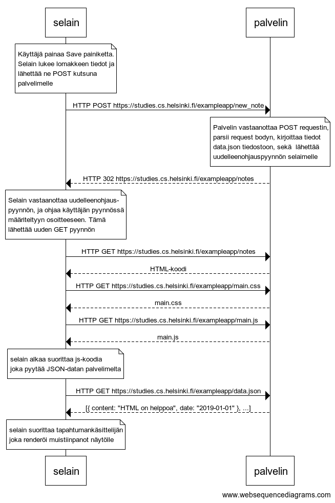

# 0.4: uusi muistiinpano



```
note over selain:
Käyttäjä painaa Save painiketta.
Selain lukee lomakkeen tiedot ja
lähettää ne POST kutsuna 
palvelimelle
end note
selain->palvelin: HTTP POST https://studies.cs.helsinki.fi/exampleapp/new_note
note over palvelin:
Palvelin vastaanottaa POST requestin,
parsii request bodyn, kirjoittaa tiedot 
data.json tiedostoon, sekä  lähettää 
uudelleenohjauspyynnön selaimelle
end note
palvelin-->selain: HTTP 302 https://studies.cs.helsinki.fi/exampleapp/notes
note over selain:
Selain vastaanottaa uudelleenohjaus-
pyynnön, ja ohjaa käyttäjän pyynnössä
määriteltyyn osoitteeseen. Tämä
lähettää uuden GET pyynnön
end note
selain->palvelin: HTTP GET https://studies.cs.helsinki.fi/exampleapp/notes
palvelin-->selain: HTML-koodi
selain->palvelin: HTTP GET https://studies.cs.helsinki.fi/exampleapp/main.css
palvelin-->selain: main.css
selain->palvelin: HTTP GET https://studies.cs.helsinki.fi/exampleapp/main.js
palvelin-->selain: main.js

note over selain:
selain alkaa suorittaa js-koodia
joka pyytää JSON-datan palvelimelta
end note

selain->palvelin: HTTP GET https://studies.cs.helsinki.fi/exampleapp/data.json
palvelin-->selain: [{ content: "HTML on helppoa", date: "2019-01-01" }, ...]

note over selain:
selain suorittaa tapahtumankäsittelijän
joka renderöi muistiinpanot näytölle
end note
```