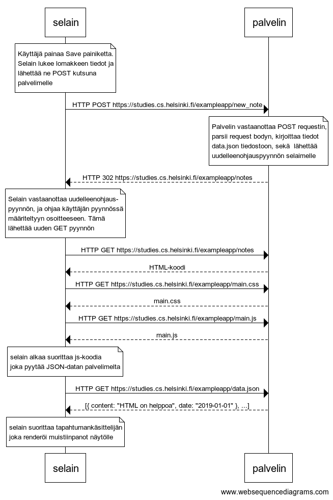
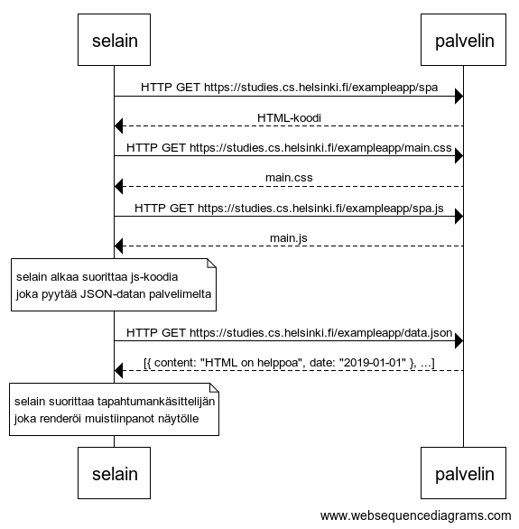
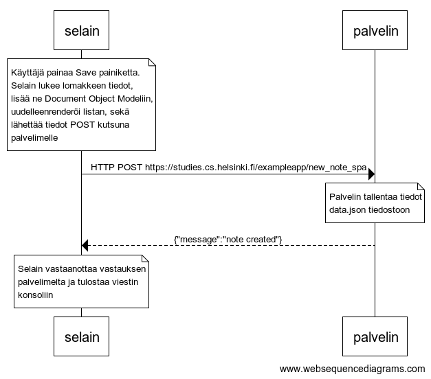

# Osion 0 vastaukset

## 0.4: Uusi muistiinpano

Tee kaavio joka kuvaa mitä tapahtuu tilanteessa, missä käyttäjä luo uuden muistiinpanon ollessaan sivulla [https://studies.cs.helsinki.fi/exampleapp/notes](https://studies.cs.helsinki.fi/exampleapp/notes), eli kirjoittaa tekstikenttään jotain ja painaa nappia tallenna.



```
note over selain:
Käyttäjä painaa Save painiketta.
Selain lukee lomakkeen tiedot ja
lähettää ne POST kutsuna 
palvelimelle
end note
selain->palvelin: HTTP POST https://studies.cs.helsinki.fi/exampleapp/new_note
note over palvelin:
Palvelin vastaanottaa POST requestin,
parsii request bodyn, kirjoittaa tiedot 
data.json tiedostoon, sekä  lähettää 
uudelleenohjauspyynnön selaimelle
end note
palvelin-->selain: HTTP 302 https://studies.cs.helsinki.fi/exampleapp/notes
note over selain:
Selain vastaanottaa uudelleenohjaus-
pyynnön, ja ohjaa käyttäjän pyynnössä
määriteltyyn osoitteeseen. Tämä
lähettää uuden GET pyynnön
end note
selain->palvelin: HTTP GET https://studies.cs.helsinki.fi/exampleapp/notes
palvelin-->selain: HTML-koodi
selain->palvelin: HTTP GET https://studies.cs.helsinki.fi/exampleapp/main.css
palvelin-->selain: main.css
selain->palvelin: HTTP GET https://studies.cs.helsinki.fi/exampleapp/main.js
palvelin-->selain: main.js

note over selain:
selain alkaa suorittaa js-koodia
joka pyytää JSON-datan palvelimelta
end note

selain->palvelin: HTTP GET https://studies.cs.helsinki.fi/exampleapp/data.json
palvelin-->selain: [{ content: "HTML on helppoa", date: "2019-01-01" }, ...]

note over selain:
selain suorittaa tapahtumankäsittelijän
joka renderöi muistiinpanot näytölle
end note
```

## 0.5: Single Page App

Tee kaavio tilanteesta, missä käyttäjä menee selaimella osoitteeseen [https://studies.cs.helsinki.fi/exampleapp/spa](https://studies.cs.helsinki.fi/exampleapp/spa) eli muistiinpanojen Single Page App-versioon



```
selain->palvelin: HTTP GET https://studies.cs.helsinki.fi/exampleapp/spa
palvelin-->selain: HTML-koodi
selain->palvelin: HTTP GET https://studies.cs.helsinki.fi/exampleapp/main.css
palvelin-->selain: main.css
selain->palvelin: HTTP GET https://studies.cs.helsinki.fi/exampleapp/spa.js
palvelin-->selain: main.js

note over selain:
selain alkaa suorittaa js-koodia
joka pyytää JSON-datan palvelimelta
end note

selain->palvelin: HTTP GET https://studies.cs.helsinki.fi/exampleapp/data.json
palvelin-->selain: [{ content: "HTML on helppoa", date: "2019-01-01" }, ...]

note over selain:
selain suorittaa tapahtumankäsittelijän
joka renderöi muistiinpanot näytölle
end note
```

## 0.6: Uusi muistiinpano

Tee kaavio tilanteesta, missä käyttäjä luo uuden muistiinpanon single page -versiossa.



```
Käyttäjä painaa Save painiketta.
Selain lukee lomakkeen tiedot,
lisää ne Document Object Modeliin,
uudelleenrenderöi listan, sekä
lähettää tiedot POST kutsuna 
palvelimelle
end note
selain->palvelin: HTTP POST https://studies.cs.helsinki.fi/exampleapp/new_note_spa
note over palvelin:
Palvelin tallentaa tiedot
data.json tiedostoon
end note
palvelin-->selain: {"message":"note created"}
note over selain:
Selain vastaanottaa vastauksen
palvelimelta ja tulostaa viestin
konsoliin
end note
```